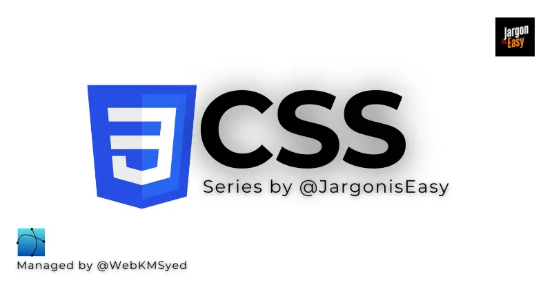
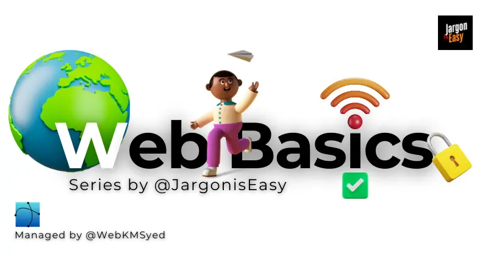

<!------------------------------------------------------------------Hero Section------------------------------------------------------------------------------------------------------------------>

  
     

 

<h1 align="center"> Full Stack Web Developer Cohort 1.0 </h1>

<b>A learning hub for Full Stack Web Developer Cohort 1.0.</b>

🗓️ Cohort Start: <b>11 Jan 2025</b>

🌠Official Website: <a href="https://chaicode.com/">Chai Code</a>

📖 My Blog <a href="https://jargoniseasy.com/">Jargon is Easy</a>
 

<!------------------------------------------------------------------About me Section------------------------------------------------------------------------------------------------------------------>

<h2 align="center">👨‍💻 About Me</h2>

  

<h3 align="center">Hi, I'm Khishamuddin Syed</h3>

Hi, I'm Khishamuddin Syed – a passionate web developer on a journey to master full-stack development.

  
  
  
  
  

 

<!------------------------------------------------------------------Mentors Section------------------------------------------------------------------------------------------------------------------>

<h2 align="center">🎓 I Learn from Top Mentors</h2>

<table align="center">
  <tr>
    <td align="center" width="50%">
      
      <h3>🆠Hitesh Choudhary&nbsp;&nbsp;&nbsp;</h3>
      
      
      
      
      
        
      
    </td>
    <td align="center" width="50%">
      
      <h3>🆠Piyush &nbsp;Garg&nbsp;&nbsp;&nbsp;</h3>
      
      
      
      
      
        
      
    </td>
  </tr>
</table> 

<!------------------------------------------------------------------Notes Section---------------------------------------------------------------------------------------------------------------------------->

<h2 align="center">📌Notes Directory</h2>

  
<h3>Lecture Notes</h3>

  
Week 01

  **Files:**

  | Thumbnail | File Name        | Description             |
  | --------- | ---------------- | ----------------------- |
  |  | [Lecture01.js](Lecture%20Notes/Week%2001/Lecture01.js) | JavaScript code file |
  |  | [Notes.txt](Lecture%20Notes/Week%2001/Notes.txt)       | Text notes           |
  |  | [README.md](Lecture%20Notes/Week%2001/README.md)       | Markdown summary     |

  
Week 02

  
  **Files:**
  
  | Thumbnail | File Name        | Description             |
  | --------- | ---------------- | ----------------------- |
  |  | [Lecture02.js](Lecture%20Notes/Week%2002/Lecture02.js) | JavaScript code file |
  |  | [Notes.txt](Lecture%20Notes/Week%2002/Notes.txt)       | Text notes           |
  |  | [README.md](Lecture%20Notes/Week%2002/README.md)       | Markdown summary     |

  
<h3>Interview & Coding Practice</h3>

  
JavaScript DSA

  
  **Files:**

  | Thumbnail | File Name         | Description         |
  | --------- | ----------------- | ------------------- |
  |  | [Practice1.js](Interview%20Coding%20Practice/Practice%20Set%201/Practice1.js) | Coding challenge    |
  |  | [TestCases.txt](Interview%20Coding%20Practice/Practice%20Set%201/TestCases.txt) | Test cases        |

  
Machine Coding Round

  
  **Files:**

  | Thumbnail | File Name         | Description         |
  | --------- | ----------------- | ------------------- |
  |  | [Practice2.js](Interview%20Coding%20Practice/Practice%20Set%202/Practice2.js) | Coding challenge    |
  |  | [TestCases.txt](Interview%20Coding%20Practice/Practice%20Set%202/TestCases.txt) | Test cases          |

  
Aptitude and Reasoning

  
  **Files:**

  | Thumbnail | File Name         | Description         |
  | --------- | ----------------- | ------------------- |
  |  | [Practice2.js](Interview%20Coding%20Practice/Practice%20Set%202/Practice2.js) | Coding challenge    |
  |  | [TestCases.txt](Interview%20Coding%20Practice/Practice%20Set%202/TestCases.txt) | Test cases          |

   

<!------------------------------------------------------------------Porject Section--------------------------------------------------------------------------------------------------------->

<h2 align="center">📌Projects</h2>

**Files:**
| Thumbnail | Project Preview | Code Files | Description |
| --------- | --------- | ----------- | ----------- |
|  |  |    | Calculator Project |

   

<!------------------------------------------------------------------Blog Section------------------------------------------------------------------------------------------------------------>

<h2 align="center">📌Blogs</h2>

### 🔥 Top Blogs

<table>
  <tr>
    <td align="center">
      
    </td>
    <td align="center">
      
       
    </td>
    <td align="center">
      
       
    </td>
  </tr>
</table>

### 🆕 Recent Blogs

<table>
  <tr>
    <td align="center">
      
    </td>
    <td align="center">
      
       
    </td>
    <td align="center">
      
       
    </td>
  </tr>
</table>

### 📚 Series

<table>
  <tr>
    <td align="center">
      
       JavaScript Series
    </td>
    <td align="center">
      
       CSS Series
    </td>
    <td align="center">
      
       HTML Series
    </td>
    <td align="center">
      
       Web Basics Series
    </td>
    <td align="center">
      
       Tech News Series
    </td>    
  </tr>
</table> 

  
<h3>Other Blogs</h3>

  
  
<h4>Web Basics</h4> 

  
|  |  |  |
| ------------- | --------- | ----------- | 
|  |  |  |

  
  
<h4>HTML</h4> 

|  |  |  |
| ------------- | --------- | ----------- | 
|  |  | <a href="https://jargoniseasy.com/series/html" target="_blank">Coming Soon</a> |

<!-- Samples of different blog grids-->
<!--
&nbsp;&nbsp;&nbsp;&nbsp;&nbsp;&nbsp;&nbsp;&nbsp;&nbsp;&nbsp;&nbsp;

-->
  

<!------------------------------------------------------------------Skills Section--------------------------------------------------------------------------------------------------------------->

<h2 align="center">🚀 Skills & Tech Stack Cover</h2>

    
    
    
    
    
    
    
    
    
    
    
    
    
    
    
    
    

  

<footer align="center">
  Made with ❤ by <a href="https://webkmsyed.com/">webkmsyed</a>
</footer>
